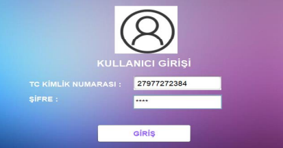

# İngilizce Kurs Sistemi

Bu Java tabanlı masaüstü uygulaması, İngilizce kurs yönetimi için tasarlanmıştır. Sistem, öğrenci kaydı, ders programı takibi ve kurs yönetimi için gerekli araçları sağlar.

## Özellikler

- Öğrenci kaydı ve yönetimi
- Ders programı oluşturma ve takip etme
- Öğretmen bilgileri yönetimi
- Kurs ücretleri takibi
- Kullanıcı girişi ve yetkilendirme

## Teknik Bilgiler

- **Programlama Dili**: Java
- **Veritabanı**: SQLite
- **Geliştirme Ortamı**: NetBeans IDE
- **Arayüz**: Java Swing

## Kurulum

1. Java Development Kit (JDK) 8 veya üstünü yükleyin
2. Projeyi bilgisayarınıza indirin
3. NetBeans IDE ile projeyi açın
4. Projeyi derleyin ve çalıştırın

Alternatif olarak, komut satırından şu komutları kullanabilirsiniz:

```
javac -cp sqlitejdbc-v056.jar -d build/classes src/*.java
java -cp build/classes:sqlitejdbc-v056.jar KURS
```

## Kullanım

1. Uygulama başlatıldığında giriş ekranı görüntülenir
2. Kullanıcı adı ve şifrenizi girin
3. Ana menüden yapmak istediğiniz işlemi seçin

## Veritabanı

Sistem SQLite veritabanı kullanmaktadır. Veritabanı dosyası (`iks.sqlite`) proje ana dizininde bulunur.

## Arayüzler

- Giriş Ekranı

  

- Öğrenci Kayıt Ekranı
- Ödeme Kayıt Ekranı
- Dekont Ekranı

## Bilinen Eksiklikler

- Ödenmiş taksitlerde güncelleme işlemi henüz aktif değil.

### `KULLANICILAR` Tablosu

Kullanıcıların (personel) T.C. Kimlik No ve Şifre bilgilerini içerir.

- `tc_kimlik_no` (Primary Key)
- `sifre`

### `OGRENCIKAYDI` Tablosu

Öğrenci kayıt bilgilerini tutar.

- `tc_kimlik_no` (Primary Key)
- Öğrenciye ait diğer bilgiler

### `ODEME` Tablosu

Ödeme bilgilerini içerir.

- `tc_kimlik_no` (Foreign Key)
- Taksit detayları
